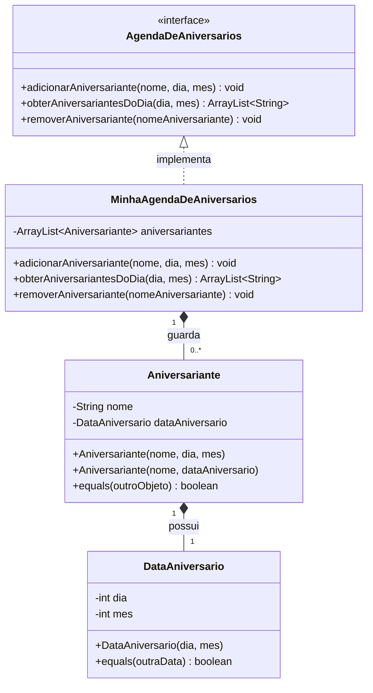

# Exercício 1 - Agenda de aniversários

Solução da Lista de Exercícios 01 da disciplina Análise e Projeto de Sistemas II.

## Diagrama de classes

## Como executar o teste

Execute a classe `TesteAgenda`, localizada em `src/test/java/Exercicio01`. Ela usa apenas recursos nativos do Java e verifica adição, consulta, remoção e igualdade.

