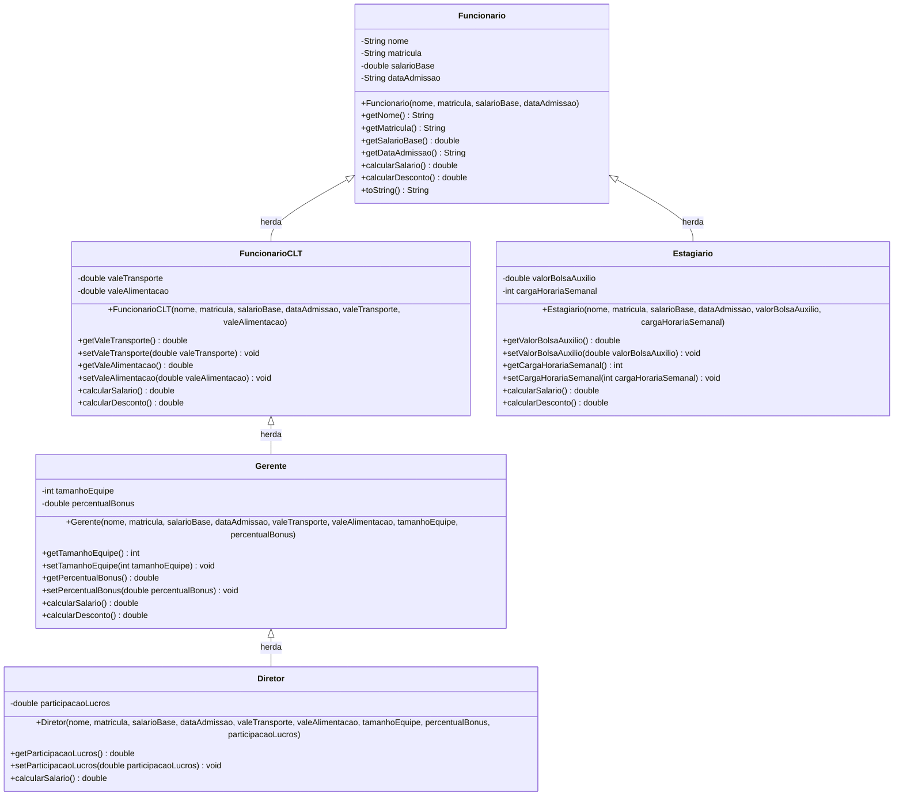

# Exercício 2 - Cálculo de salário de funcionários com herança

Solução da Lista de Exercícios 02 da disciplina **Análise e Projeto de Sistemas II** (UNIPÊ).

## Diagrama de classes

## Regras Implementadas

1. **Funcionario (Classe base)**:
   - `calcularSalario()`: retorna o salário-base.
   - `calcularDesconto()`: retorna 8% do salário-base.
   - `toString()`: formata nome, matrícula, salário bruto, desconto e salário líquido.

2. **FuncionarioCLT**:
   - Herda de `Funcionario`.
   - `calcularSalario()`: `super.calcularSalario() + valeTransporte + valeAlimentacao`.
   - `calcularDesconto()`: `super.calcularDesconto() + 50.0`.

3. **Gerente**:
   - Herda de `FuncionarioCLT`.
   - `calcularSalario()`: `super.calcularSalario() + (salarioBase * percentualBonus)`.
   - `calcularDesconto()`: `super.calcularDesconto()` + R$ 100,00 se `tamanhoEquipe > 10`.

4. **Estagiario**:
   - Herda diretamente de `Funcionario`.
   - `calcularSalario()`: `valorBolsaAuxilio`.
   - `calcularDesconto()`: `0.0`.

5. **Diretor (Desafio opcional)**:
   - Herda de `Gerente`.
   - `calcularSalario()`: `super.calcularSalario() + participacaoLucros`.

## Como executar o teste

Execute a classe `TesteFuncionarios`, localizada em `src/test/java/Exercicio02`. Ela instancia cada tipo de funcionário com os dados do exercício e valida os valores esperados.
